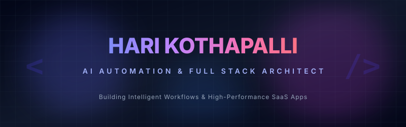



  

<h3 align="center">✨ AI &amp; Full-Stack Software Engineer ✨</h3>

  
  
  

---

<table width="100%" style="border-collapse: collapse; border: none; border-spacing: 0;">
  <tr style="border: none;">
    <td width="55%" style="border: none; vertical-align: top; padding-right: 20px;">
      <h3>💼 Objective &amp; Profile</h3>
      
<strong>Kothapalli Hari Venkata Sai Mani Kumar</strong>

      <blockquote>
        Passionate AI and Full-Stack Developer with hands-on experience in building web applications, AI-powered platforms, and automation systems. Skilled in Python, React, Flask, and modern web technologies with a strong interest in artificial intelligence, automation, and scalable software development. Seeking opportunities to contribute technical expertise while continuously learning and growing in a dynamic environment.
      </blockquote>
      
📱 <strong>Contact:</strong> (+91) 9347892915 | Eluru, Andhra Pradesh, India

    </td>
    <td width="45%" style="border: none; vertical-align: top; padding-left: 10px;">
      <h3>📊 GitHub Activity</h3>
      

        
      

    </td>
  </tr>
</table>

---

<table width="100%" style="border-collapse: collapse; border: none; border-spacing: 0;">
  <tr style="border: none;">
    <td width="50%" style="border: none; vertical-align: top; padding-right: 15px;">
      <h3>🎓 Education</h3>
      <ul>
        <li>
          <strong>B.Tech in Computer Engineering &amp; AI</strong> 
          <em>Sri Vasavi Engineering College, Tadepalligudem</em> 
          2024 - Present
        </li>
         
        <li>
          <strong>Diploma (DCME)</strong> 
          <em>Sir Crr Polytechnic College, Eluru</em> 
          2021 - 2024
        </li>
      </ul>
    </td>
    <td width="50%" style="border: none; vertical-align: top; padding-left: 15px;">
      <h3>🏅 Certifications</h3>
      <ul>
        <li>
          <strong>Python Programming</strong> 
          <em>VIT Institute</em> - 2022
        </li>
         
        <li>
          <strong>Core Java</strong> 
          <em>VIT Institute</em> - 2023
        </li>
      </ul>
    </td>
  </tr>
</table>

---

### 🛠️ My Technology Toolkit

<table width="100%" style="border-collapse: collapse; border: none;">
  <tr style="border: none;">
    <td width="33%" style="border: none; vertical-align: top; padding-bottom: 15px;">
      <strong>💻 Languages</strong> 
      &bull; Python  
      &bull; C  
      &bull; Java  
      &bull; JavaScript
    </td>
    <td width="33%" style="border: none; vertical-align: top; padding-bottom: 15px;">
      <strong>⚙️ Frameworks &amp; DBs</strong> 
      &bull; Flask  
      &bull; React  
      &bull; MongoDB  
      &bull; MySQL
    </td>
    <td width="33%" style="border: none; vertical-align: top; padding-bottom: 15px;">
      <strong>🤖 Tech &amp; Automation</strong> 
      &bull; n8n (Learning)  
      &bull; HTML5 &amp; CSS3  
      &bull; AI API Integration  
      &bull; Git &amp; Version Control
    </td>
  </tr>
</table>

---

### 🌟 Portfolio &amp; Projects

<table width="100%" style="border-collapse: collapse; border: none;">
  <!-- Project 1 -->
  <tr style="border: none;">
    <td style="border: none; padding-bottom: 20px;">
      <h4>⚖️ <a href="https://nyayavyavasth.vercel.app/">Nyaya Vyavastha</a> 🏆 <em>3rd Prize - Hackathon Winner</em></h4>
      
A legal awareness and justice-focused web platform designed to simplify legal information by providing accessible resources, structured guidance on procedures, and user-friendly navigation of rights, laws, and judicial processes.

      

        
        
        
        
      

    </td>
  </tr>
  <!-- Project 2 -->
  <tr style="border: none;">
    <td style="border: none; padding-bottom: 20px;">
      <h4>📚 <a href="https://lernyx.vercel.app/">Learn Ex (Lernyx)</a> 🏆 <em>2nd Prize - Hackelerate Winner</em></h4>
      
An AI-powered educational platform designed to provide intelligent learning assistance, simplified explanations of complex topics, and curated study resources to enhance student learning experiences.

      

        
        
        
        
      

    </td>
  </tr>
  <!-- Project 3 -->
  <tr style="border: none;">
    <td style="border: none; padding-bottom: 20px;">
      <h4>🏋️ <a href="https://project-10-5i32.onrender.com/">Fit Track</a></h4>
      
A comprehensive fitness tracking web application that enables users to log workouts, monitor fitness progress, and analyze performance through interactive charts, analytics, and personalized tracking features.

      

        
        
        
        
      

    </td>
  </tr>
  <!-- Project 4 -->
  <tr style="border: none;">
    <td style="border: none; padding-bottom: 20px;">
      <h4>🛒 <a href="http://br4ev.vercel.app/">Online Men's E-Commerce</a></h4>
      
A modern e-commerce platform for men's fashion that offers product catalog browsing, shopping cart functionality, secure checkout, order management, and a seamless online shopping experience.

      

        
        
        
      

    </td>
  </tr>
  <!-- Project 5 -->
  <tr style="border: none;">
    <td style="border: none; padding-bottom: 20px;">
      <h4>🏫 College Management System <em>(Not Deployed)</em></h4>
      
A full-scale ERP solution for educational institutions featuring student information management, faculty and administration portals, attendance monitoring, timetable automation, and academic record management.

      

        
        
        
      

    </td>
  </tr>
  <!-- Project 6 -->
  <tr style="border: none;">
    <td style="border: none; padding-bottom: 20px;">
      <h4>🎓 <a href="http://16.16.183.242/">Best Outgoing Student Portal</a></h4>
      
A student achievement and recognition platform designed to manage and showcase outstanding student performance, academic excellence, extracurricular accomplishments, and institutional rankings.

      

        
        
        
      

    </td>
  </tr>
  <!-- Project 7 -->
  <tr style="border: none;">
    <td style="border: none;">
      <h4>🤖 Automated News Delivery System</h4>
      
An intelligent n8n-based automation workflow that automatically triggers every day at 9:00 AM, fetches the latest news from the Sakshi News website, processes and summarizes the content, and delivers news updates via an automated email pipeline.

      

        
        
        
      

    </td>
  </tr>
</table>

---

<table width="100%" style="border-collapse: collapse; border: none; border-spacing: 0;">
  <tr style="border: none;">
    <td width="50%" style="border: none; vertical-align: top; padding-right: 15px;">
      <h3>🏆 Achievements</h3>
      <ul>
        <li><strong>3rd Prize - Nyaya Vyavastha:</strong> Secured 3rd place in a 24-Hour Hackathon (cash prize of ₹ 5,000) for developing a legal awareness web platform.</li>
         
        <li><strong>2nd Prize - Learn Ex:</strong> Won 2nd place in the Hackelerate Hackathon (cash prize of ₹ 1,500) for building an AI-powered educational platform.</li>
      </ul>
    </td>
    <td width="50%" style="border: none; vertical-align: top; padding-left: 15px;">
      <h3>💪 Key Strengths</h3>
      <ul>
        <li><strong>Quick Learner:</strong> Adaptable and fast to integrate new technologies.</li>
         
        <li><strong>Organized:</strong> Excellent time management and organizational skills.</li>
         
        <li><strong>Self-Motivated:</strong> Passionate about continuous learning and development.</li>
      </ul>
    </td>
  </tr>
</table>

---

### 📈 Language &amp; Streak Metrics

<table width="100%" style="border-collapse: collapse; border: none;">
  <tr style="border: none;">
    <td width="50%" style="border: none; padding-right: 10px;">
      
    </td>
    <td width="50%" style="border: none; padding-left: 10px;">
      
    </td>
  </tr>
</table>

 

  

<h4 align="center">✨ "Automating the repetitive, designing the exceptional." ✨</h4>
